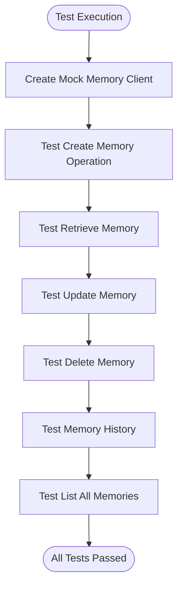
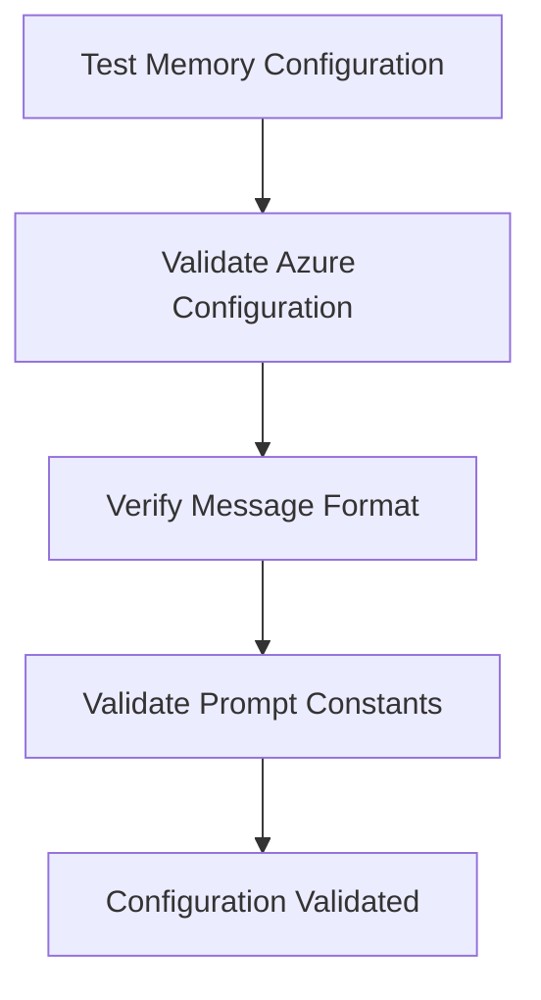
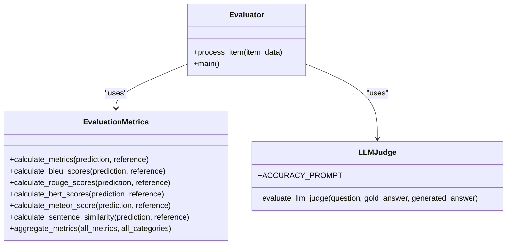
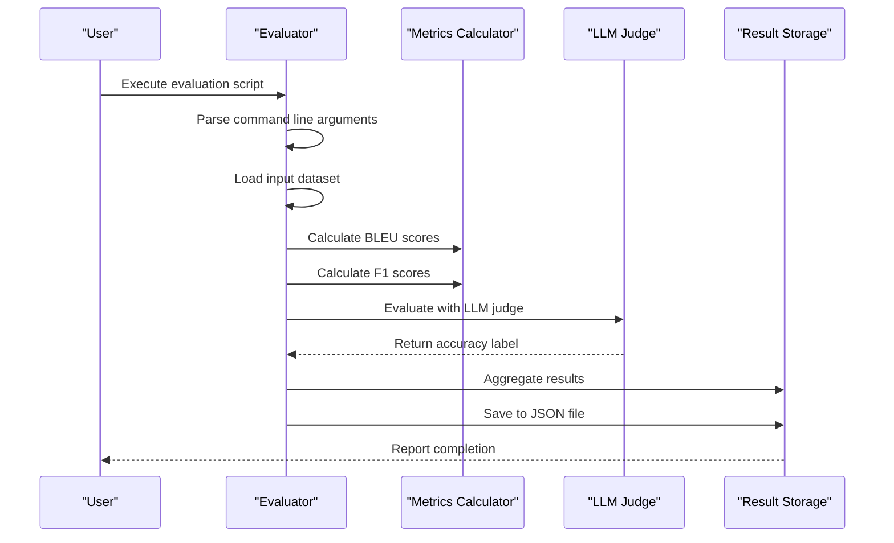

# Testing and Evaluation

<cite>
**Referenced Files in This Document**   
- [test_memory.py](file://tests/test_memory.py)
- [test_memory_integration.py](file://tests/test_memory_integration.py)
- [evals.py](file://evaluation/evals.py)
- [metrics/llm_judge.py](file://evaluation/metrics/llm_judge.py)
- [metrics/utils.py](file://evaluation/metrics/utils.py)
</cite>

## Table of Contents
1. [Introduction](#introduction)
2. [Testing Strategy](#testing-strategy)
3. [Evaluation Framework](#evaluation-framework)
4. [Benchmarking Methodologies](#benchmarking-methodologies)
5. [Quality Assurance Processes](#quality-assurance-processes)
6. [Running Tests and Interpreting Results](#running-tests-and-interpreting-results)
7. [Test Coverage Goals](#test-coverage-goals)
8. [Continuous Integration Practices](#continuous-integration-practices)
9. [Guidance for Contributors](#guidance-for-contributors)

## Introduction
The Mem0 project implements a comprehensive testing and evaluation framework to ensure the reliability, accuracy, and performance of its memory management system. This document details the testing strategy, evaluation metrics, and quality assurance processes that validate the system's ability to store, retrieve, and reason about user memories effectively. The framework combines unit testing, integration testing, and sophisticated evaluation methodologies to measure memory accuracy, relevance, and system performance.

## Testing Strategy

The testing strategy for Mem0 is multi-layered, encompassing unit tests, integration tests, and end-to-end validation. The tests are organized in the `tests/` directory with a clear structure that mirrors the application's architecture.

### Unit Testing
Unit tests focus on individual components and functions, ensuring they behave as expected in isolation. The test suite uses pytest as the testing framework with unittest.mock for creating test doubles. The `test_memory.py` file contains unit tests for the core Memory class, testing individual operations like add, get, update, delete, and history retrieval.



**Diagram sources**
- [test_memory.py](file://tests/test_memory.py#L18-L82)

**Section sources**
- [test_memory.py](file://tests/test_memory.py#L31-L75)

### Integration Testing
Integration tests verify that multiple components work together correctly. The `test_memory_integration.py` file contains tests that validate the configuration and interaction between different system components, including LLM providers, vector stores, and embedders. These tests ensure that the system can be properly configured without relying on environment variables and that the message format and configuration structures are correct.



**Diagram sources**
- [test_memory_integration.py](file://tests/test_memory_integration.py#L6-L181)

**Section sources**
- [test_memory_integration.py](file://tests/test_memory_integration.py#L6-L181)

## Evaluation Framework

The evaluation framework in Mem0 is designed to measure the quality of memory retrieval and reasoning through multiple dimensions: accuracy, relevance, and performance. The framework is implemented in the `evaluation/` directory and uses both automated metrics and LLM-based judgment.

### Memory Accuracy Evaluation
Memory accuracy is evaluated by comparing the system's responses to ground truth answers using multiple metrics. The evaluation process involves calculating various similarity scores between predicted and actual answers.



**Diagram sources**
- [metrics/utils.py](file://evaluation/metrics/utils.py#L116-L164)
- [metrics/llm_judge.py](file://evaluation/metrics/llm_judge.py#L39-L55)
- [evals.py](file://evaluation/evals.py#L12-L43)

**Section sources**
- [metrics/utils.py](file://evaluation/metrics/utils.py#L116-L164)
- [metrics/llm_judge.py](file://evaluation/metrics/llm_judge.py#L39-L55)

### Relevance Metrics
The framework evaluates answer relevance through multiple automated metrics:
- **BLEU scores**: Measure n-gram overlap between predicted and reference answers
- **ROUGE scores**: Evaluate recall-oriented n-gram overlap
- **BERTScore**: Calculate semantic similarity using BERT embeddings
- **METEOR score**: Consider synonymy and stemming in similarity calculation
- **Sentence similarity**: Use SentenceTransformer embeddings to measure semantic similarity

These metrics are implemented in the `metrics/utils.py` file and provide a comprehensive assessment of how closely the generated answers match the expected responses in both surface form and meaning.

### Performance Evaluation
Performance evaluation focuses on both computational efficiency and response quality. The framework measures:
- Response time for memory operations
- Resource utilization during evaluation
- Scalability with increasing data volumes
- Consistency across different categories of queries

The evaluation system uses concurrent.futures to parallelize the evaluation process, allowing for efficient processing of large datasets with configurable worker threads.

## Benchmarking Methodologies

The benchmarking methodology in Mem0 follows a systematic approach to measure system performance and quality across different scenarios and configurations.

### Evaluation Pipeline
The evaluation pipeline processes results from RAG (Retrieval-Augmented Generation) systems and generates comprehensive metrics. The main evaluation script (`evals.py`) follows this workflow:



**Diagram sources**
- [evals.py](file://evaluation/evals.py#L45-L81)
- [metrics/llm_judge.py](file://evaluation/metrics/llm_judge.py#L39-L55)

**Section sources**
- [evals.py](file://evaluation/evals.py#L45-L81)

### LLM-Based Judgment
The framework employs a sophisticated LLM-based judgment system to evaluate answer correctness. The `llm_judge.py` module uses GPT-4o-mini to compare generated answers with ground truth answers, providing a more nuanced assessment than simple string matching. The judge is instructed to be generous in its grading, considering answers correct if they touch on the same topic as the gold answer, even if expressed differently.

The evaluation prompt is carefully designed to guide the LLM judge to provide consistent and reliable assessments, with specific instructions for handling time-related questions and varying answer formats.

## Quality Assurance Processes

The quality assurance processes in Mem0 ensure that the system maintains high standards of reliability and performance through comprehensive testing and validation.

### Defensive Programming
The codebase demonstrates strong defensive programming practices, particularly in handling edge cases and incomplete data. The `test_search_handles_incomplete_payloads` test in `test_memory.py` verifies that the search functionality can gracefully handle memory objects with missing data fields, ensuring the system remains robust even with imperfect data.

### Configuration Validation
The integration tests include comprehensive validation of configuration structures, particularly for complex setups like Azure services. The tests verify that all required fields are present and properly formatted, preventing configuration-related errors in production environments.

### Mocking Strategy
The testing framework extensively uses mocking to isolate components and avoid external dependencies. The tests mock external services like vector stores, embedders, and LLM providers, allowing for reliable and fast test execution without requiring actual API calls or network connectivity.

## Running Tests and Interpreting Results

### Executing the Test Suite
To run the test suite, execute the following commands from the project root directory:

```bash
# Run all tests
pytest tests/

# Run specific test file
pytest tests/test_memory.py

# Run with detailed output
pytest tests/ -v

# Run with coverage reporting
pytest tests/ --cov=mem0 --cov-report=html
```

### Running Evaluations
The evaluation framework can be executed using the provided scripts:

```bash
# Run basic evaluation
python evaluation/evals.py --input_file results/rag_results.json --output_file evaluation_metrics.json

# Run with custom worker count
python evaluation/evals.py --input_file results/rag_results.json --max_workers 20
```

### Interpreting Test Results
Test results should be interpreted as follows:
- **Unit tests**: All tests should pass, indicating that individual components function correctly
- **Integration tests**: Successful execution confirms that components work together as expected
- **Evaluation metrics**: Higher scores indicate better performance across different dimensions:
  - BLEU/F1/ROUGE scores: Closer to 1.0 indicates better match with reference
  - LLM judge score: 1.0 indicates correct answer, 0.0 indicates incorrect
  - Sentence similarity: Closer to 1.0 indicates higher semantic similarity

## Test Coverage Goals

The project aims for comprehensive test coverage across all critical components:
- **Core memory operations**: 100% coverage for add, get, update, delete, and list operations
- **Configuration handling**: Complete coverage for all configuration variants and edge cases
- **Error conditions**: Thorough testing of error handling and edge cases
- **Integration points**: Comprehensive coverage of interactions between components
- **Performance characteristics**: Benchmarking across different data volumes and configurations

The test suite should maintain high coverage to ensure the reliability and stability of the memory management system.

## Continuous Integration Practices

The continuous integration pipeline for Mem0 includes the following practices:
- Automated test execution on every pull request
- Code coverage reporting and thresholds
- Static code analysis and linting
- Dependency vulnerability scanning
- Documentation generation and validation

The CI system ensures that all tests pass before code can be merged, maintaining the quality and stability of the codebase.

## Guidance for Contributors

### Writing Effective Tests
When adding new features or modifying existing code, contributors should follow these guidelines for writing effective tests:

1. **Test individual components in isolation** using mocks for dependencies
2. **Cover both success and failure cases** to ensure robust error handling
3. **Use descriptive test names** that clearly indicate what is being tested
4. **Include edge cases** that test boundary conditions and unusual inputs
5. **Keep tests focused and independent** of each other

### Example Test Pattern
When writing tests for new memory operations, follow the pattern established in `test_memory.py`:

```python
def test_operation_name(client):
    # Arrange: Set up test data and mocks
    test_data = "test content"
    
    # Act: Perform the operation
    result = client.operation(test_data, user_id="test_user")
    
    # Assert: Verify the expected outcome
    assert result["expected_field"] == expected_value
```

### Adding Evaluation Metrics
When implementing new evaluation metrics, follow the structure in `metrics/utils.py`:
1. Create a dedicated function for the metric calculation
2. Handle edge cases and potential errors gracefully
3. Return a consistent data structure
4. Add comprehensive documentation
5. Include tests for the metric calculation

By following these guidelines, contributors can ensure that new code is well-tested and maintains the high quality standards of the Mem0 project.