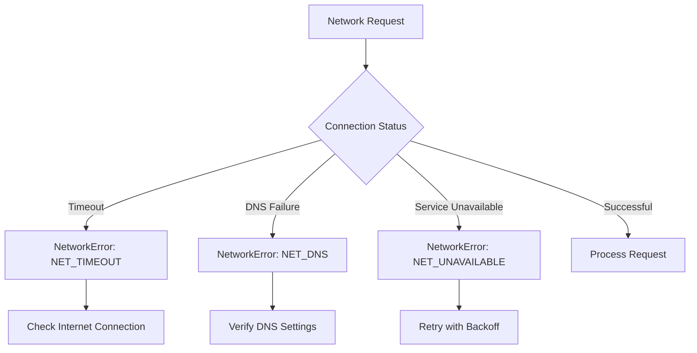
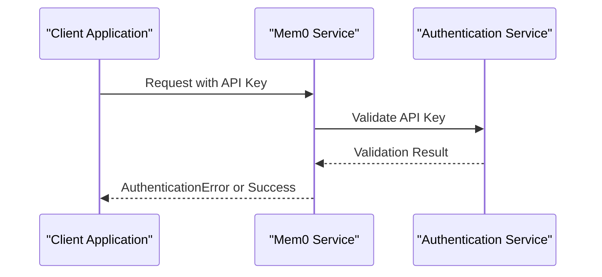
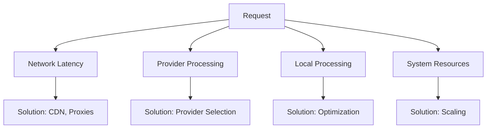
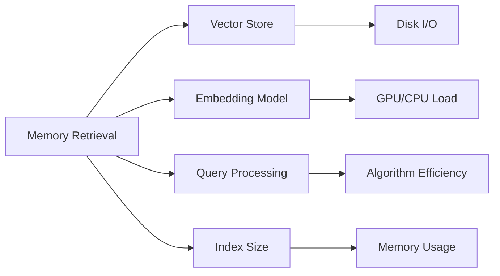
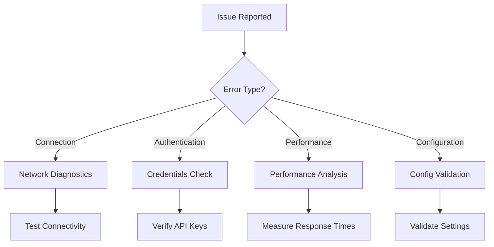

# Troubleshooting

<cite>
**Referenced Files in This Document**
- [exceptions.py](file://mem0/exceptions.py)
- [telemetry.py](file://mem0/memory/telemetry.py)
- [utils.py](file://mem0/client/utils.py)
- [main.py](file://mem0/memory/main.py)
- [base.py](file://mem0/configs/base.py)
- [factory.py](file://mem0/utils/factory.py)
- [test_main.py](file://tests/test_main.py)
- [test_main.py](file://tests/memory/test_main.py)
- [test_openai_embeddings.py](file://tests/embeddings/test_openai_embeddings.py)
- [test_chroma.py](file://tests/vector_stores/test_chroma.py)
</cite>

## Table of Contents
1. [Introduction](#introduction)
2. [Common Issues and Solutions](#common-issues-and-solutions)
3. [Error Codes Reference](#error-codes-reference)
4. [Debugging with Telemetry](#debugging-with-telemetry)
5. [Performance Issue Diagnosis](#performance-issue-diagnosis)
6. [Configuration Problems](#configuration-problems)
7. [Provider-Specific Issues](#provider-specific-issues)
8. [Logging and Monitoring](#logging-and-monitoring)
9. [Diagnostic Procedures](#diagnostic-procedures)
10. [Real-World Examples](#real-world-examples)

## Introduction

This comprehensive troubleshooting guide addresses common issues encountered when working with Mem0, a memory management system for AI applications. The guide covers connection failures, authentication errors, slow response times, memory retrieval problems, and provides practical solutions with step-by-step diagnostic procedures.

Mem0 uses a structured exception handling system with specific error codes, suggestions, and debug information to enable better error handling and recovery in applications. Understanding these error patterns is crucial for effective troubleshooting.

## Common Issues and Solutions

### Connection Failures

Connection failures are among the most common issues in distributed systems. Mem0 handles various network-related problems through its structured exception system.

#### Symptoms
- Request timeouts
- DNS resolution failures
- Service unavailability
- Network connectivity issues

#### Error Patterns


**Diagram sources**
- [exceptions.py](file://mem0/exceptions.py#L179-L200)
- [utils.py](file://mem0/client/utils.py#L88-L115)

#### Resolution Steps

1. **Check Internet Connectivity**
   ```bash
   ping api.mem0.ai
   curl -I https://api.mem0.ai
   ```

2. **Verify Proxy Settings**
   ```python
   # Check if proxy is interfering
   import os
   print(os.environ.get('HTTP_PROXY'))
   print(os.environ.get('HTTPS_PROXY'))
   ```

3. **Implement Retry Logic**
   ```python
   import time
   from mem0.exceptions import NetworkError
   
   def safe_operation(operation, max_retries=3):
       for attempt in range(max_retries):
           try:
               return operation()
           except NetworkError as e:
               if attempt == max_retries - 1:
                   raise
               wait_time = 2 ** attempt  # Exponential backoff
               time.sleep(wait_time)
   ```

### Authentication Errors

Authentication failures occur when API keys are invalid, missing, or expired.

#### Symptoms
- 401 Unauthorized responses
- Invalid API key messages
- Expired authentication tokens

#### Error Patterns


**Diagram sources**
- [exceptions.py](file://mem0/exceptions.py#L93-L112)

#### Resolution Steps

1. **Verify API Key Configuration**
   ```python
   import os
   from mem0.memory.main import Memory
   
   # Check environment variable
   api_key = os.environ.get('MEM0_API_KEY')
   if not api_key:
       raise ValueError("MEM0_API_KEY not found in environment")
   
   # Test API key validity
   try:
       memory = Memory()
       memory.add("Test memory", user_id="test")
   except AuthenticationError as e:
       print(f"Authentication failed: {e.message}")
       print(f"Error code: {e.error_code}")
       print(f"Suggestion: {e.suggestion}")
   ```

2. **Check API Key Format**
   ```python
   def validate_api_key_format(api_key):
       """Validate API key format"""
       if not api_key or len(api_key) < 10:
           return False
       return api_key.startswith('sk-') or len(api_key) > 30
   ```

### Slow Response Times

Slow response times can be caused by various factors including network latency, provider performance, or system overload.

#### Symptoms
- Requests taking longer than expected
- Timeout errors
- High CPU or memory usage

#### Performance Factors


**Diagram sources**
- [main.py](file://mem0/memory/main.py#L131-L170)

#### Resolution Strategies

1. **Monitor Response Times**
   ```python
   import time
   from mem0.memory.main import Memory
   
   def measure_performance():
       memory = Memory()
       
       start_time = time.time()
       memory.add("Test memory", user_id="test")
       add_time = time.time() - start_time
       
       start_time = time.time()
       memory.search("Test query", user_id="test")
       search_time = time.time() - start_time
       
       print(f"Add operation: {add_time:.2f}s")
       print(f"Search operation: {search_time:.2f}s")
   ```

2. **Optimize Provider Configuration**
   ```python
   # Example: Optimizing OpenAI configuration
   config = {
       "llm": {
           "provider": "openai",
           "config": {
               "model": "gpt-4o-mini",
               "temperature": 0.1,
               "max_tokens": 1000
           }
       },
       "embedder": {
           "provider": "openai",
           "config": {
               "model": "text-embedding-3-small",
               "dimensions": 1536
           }
       }
   }
   ```

## Error Codes Reference

Mem0 provides structured error codes for different types of failures. Understanding these codes helps in implementing appropriate error handling strategies.

### Base Error Classes

| Error Class | Error Code Pattern | Description |
|-------------|-------------------|-------------|
| `MemoryError` | `MEM_XXX` | General memory operation errors |
| `AuthenticationError` | `AUTH_XXX` | Authentication and authorization failures |
| `RateLimitError` | `RATE_XXX` | API rate limiting violations |
| `ValidationError` | `VAL_XXX` | Input validation failures |
| `MemoryNotFoundError` | `MEM_404` | Memory not found errors |
| `NetworkError` | `NET_XXX` | Network connectivity issues |
| `ConfigurationError` | `CFG_XXX` | Configuration-related problems |

### HTTP Status Code Mappings

| HTTP Status | Mem0 Exception | Common Causes |
|-------------|----------------|---------------|
| 400 | `ValidationError` | Invalid request parameters |
| 401 | `AuthenticationError` | Invalid API key |
| 403 | `AuthenticationError` | Insufficient permissions |
| 404 | `MemoryNotFoundError` | Non-existent memory |
| 408 | `NetworkError` | Request timeout |
| 409 | `ValidationError` | Resource conflict |
| 413 | `MemoryQuotaExceededError` | Request too large |
| 422 | `ValidationError` | Unprocessable entity |
| 429 | `RateLimitError` | Rate limit exceeded |
| 500 | `MemoryError` | Internal server error |
| 502 | `NetworkError` | Bad gateway |
| 503 | `NetworkError` | Service unavailable |
| 504 | `NetworkError` | Gateway timeout |

### Specific Error Codes

#### Authentication Errors
- `AUTH_001`: Invalid API key
- `AUTH_002`: Expired authentication token
- `AUTH_003`: Missing authentication headers

#### Network Errors
- `NET_001`: Connection timeout
- `NET_002`: DNS resolution failure
- `NET_003`: Service temporarily unavailable
- `NET_TIMEOUT`: Request timeout
- `NET_CONNECT`: Connection failed

#### Configuration Errors
- `CFG_001`: API key not configured
- `CFG_002`: Invalid host URL
- `CFG_003`: Missing required environment variables

**Section sources**
- [exceptions.py](file://mem0/exceptions.py#L424-L503)

## Debugging with Telemetry

Mem0 includes comprehensive telemetry capabilities that provide insights into system performance and help identify issues.

### Telemetry Data Collection

The telemetry system captures detailed information about memory operations, including:

- Client information (Python version, OS)
- Memory configuration details
- Operation performance metrics
- Error patterns and frequencies

### Enabling Telemetry

Telemetry is enabled by default but can be controlled via environment variables:

```python
import os
os.environ['MEM0_TELEMETRY'] = 'False'  # Disable telemetry
```

### Interpreting Telemetry Data

Key telemetry events include:

1. **`mem0.init`**: Memory instance initialization
2. **`mem0.add`**: Memory addition operations
3. **`mem0.search`**: Memory search operations
4. **`mem0.update`**: Memory update operations
5. **`mem0.delete`**: Memory deletion operations

### Debug Information Access

Each exception includes debug information that can be accessed programmatically:

```python
try:
    memory.add(content, user_id=user_id)
except MemoryError as e:
    print(f"Error: {e.message}")
    print(f"Code: {e.error_code}")
    print(f"Debug Info: {e.debug_info}")
    print(f"Details: {e.details}")
    print(f"Suggestion: {e.suggestion}")
```

**Section sources**
- [telemetry.py](file://mem0/memory/telemetry.py#L1-L91)

## Performance Issue Diagnosis

### Memory Retrieval Problems

Memory retrieval issues often stem from vector store performance, embedding model efficiency, or query optimization.

#### Common Performance Bottlenecks



#### Diagnostic Checklist

1. **Vector Store Performance**
   ```python
   # Monitor vector store operations
   import time
   
   def diagnose_vector_store(memory):
       # Test basic operations
       start = time.time()
       memory.add("Test", user_id="diag")
       add_time = time.time() - start
       
       start = time.time()
       memory.search("Test", user_id="diag")
       search_time = time.time() - start
       
       print(f"Add time: {add_time:.3f}s")
       print(f"Search time: {search_time:.3f}s")
   ```

2. **Embedding Model Performance**
   ```python
   # Measure embedding generation time
   def measure_embedding_performance(embedder):
       test_texts = ["Short text", "Medium length text with some details", "Very long text with extensive information"]
       
       for text in test_texts:
           start = time.time()
           embedder.embed(text)
           duration = time.time() - start
           print(f"Text length {len(text)}: {duration:.3f}s")
   ```

### Optimization Strategies

#### 1. Provider Selection
Choose appropriate providers based on your use case:

- **Fast Inference**: OpenAI GPT-4o-mini, Claude Haiku
- **Cost Effective**: OpenAI text-embedding-3-small
- **High Quality**: OpenAI text-embedding-3-large, Cohere Embed-English-V3.0

#### 2. Batch Operations
Process multiple memories in batches to improve throughput:

```python
def batch_add_memories(memory, messages_list, user_id):
    """Add multiple memories efficiently"""
    # Group by user_id for batch processing
    from collections import defaultdict
    
    user_batches = defaultdict(list)
    for msg in messages_list:
        user_batches[user_id].append(msg)
    
    results = []
    for user, msgs in user_batches.items():
        # Process each user's messages together
        result = memory.add(msgs, user_id=user)
        results.extend(result)
    
    return results
```

#### 3. Index Optimization
For large datasets, consider:
- Reducing embedding dimensions (1536 → 768)
- Using approximate nearest neighbor search
- Implementing caching for frequently accessed memories

## Configuration Problems

### Common Configuration Issues

Configuration problems are frequent sources of runtime errors. Here are the most common issues and their solutions.

#### Environment Variables

```python
# Essential environment variables
REQUIRED_ENV_VARS = [
    'MEM0_API_KEY',
    'OPENAI_API_KEY',
    'ANTHROPIC_API_KEY',
    'GOOGLE_API_KEY'
]

OPTIONAL_ENV_VARS = [
    'MEM0_DIR',
    'HTTP_PROXY',
    'HTTPS_PROXY'
]

def validate_environment():
    """Validate required environment variables"""
    missing_vars = [var for var in REQUIRED_ENV_VARS if not os.environ.get(var)]
    
    if missing_vars:
        raise ConfigurationError(
            message="Missing required environment variables",
            error_code="CFG_001",
            details={"missing_variables": missing_vars},
            suggestion="Set all required environment variables"
        )
```

#### Configuration File Structure

```python
# Example configuration structure
config = {
    "vector_store": {
        "provider": "chroma",
        "config": {
            "collection_name": "memories",
            "host": "localhost",
            "port": 8000
        }
    },
    "llm": {
        "provider": "openai",
        "config": {
            "model": "gpt-4o-mini",
            "temperature": 0.1
        }
    },
    "embedder": {
        "provider": "openai",
        "config": {
            "model": "text-embedding-3-small",
            "dimensions": 1536
        }
    }
}
```

### Provider Configuration Validation

Different providers require specific configuration parameters:

#### OpenAI Configuration
```python
openai_config = {
    "provider": "openai",
    "config": {
        "model": "gpt-4o-mini",
        "api_key": "your-api-key",
        "max_tokens": 1000,
        "temperature": 0.1,
        "timeout": 30
    }
}
```

#### ChromaDB Configuration
```python
chroma_config = {
    "provider": "chroma",
    "config": {
        "collection_name": "memories",
        "host": "localhost",
        "port": 8000,
        "persist_directory": "./chroma_db"
    }
}
```

**Section sources**
- [base.py](file://mem0/configs/base.py#L1-L86)
- [factory.py](file://mem0/utils/factory.py#L87-L126)

## Provider-Specific Issues

### Vector Store Providers

#### ChromaDB Issues
- **Connection Problems**: Verify host and port settings
- **Persistence Issues**: Check disk space and permissions
- **Index Corruption**: Rebuild indices if necessary

#### Pinecone Issues
- **API Key Problems**: Verify Pinecone API key and environment
- **Index Not Found**: Ensure index exists before querying
- **Rate Limiting**: Implement exponential backoff

#### Qdrant Issues
- **Cluster Connectivity**: Verify cluster URL and authentication
- **Collection Management**: Ensure collections are properly created
- **Storage Limits**: Monitor disk usage and quotas

### LLM Provider Issues

#### OpenAI Issues
- **Rate Limiting**: Implement proper backoff strategies
- **Token Limits**: Handle context window limitations
- **Model Availability**: Check model status and availability

#### Anthropic Issues
- **Claude Model Access**: Verify Claude model permissions
- **Content Filtering**: Handle content moderation responses
- **Streaming Issues**: Implement proper streaming error handling

### Embedding Provider Issues

#### Dimension Mismatch
Ensure embedding dimensions match across providers:
```python
# Check embedding dimensions
def validate_embedding_dimensions(embedder, expected_dims):
    if embedder.config.embedding_dims != expected_dims:
        raise ValueError(f"Dimension mismatch: {embedder.config.embedding_dims} vs {expected_dims}")
```

**Section sources**
- [factory.py](file://mem0/utils/factory.py#L150-L175)

## Logging and Monitoring

### Structured Logging

Implement comprehensive logging to track system behavior and identify issues:

```python
import logging
from mem0.exceptions import MemoryError

# Configure logging
logging.basicConfig(
    level=logging.INFO,
    format='%(asctime)s - %(name)s - %(levelname)s - %(message)s',
    handlers=[
        logging.FileHandler('mem0_errors.log'),
        logging.StreamHandler()
    ]
)

logger = logging.getLogger('mem0')

def log_error(error, context=None):
    """Log errors with context"""
    logger.error(f"Error: {error.message}")
    logger.error(f"Code: {error.error_code}")
    logger.error(f"Context: {context}")
    logger.error(f"Debug Info: {error.debug_info}")
    
    # Capture telemetry data
    from mem0.memory.telemetry import capture_event
    capture_event("error", error, {
        "error_code": error.error_code,
        "error_message": error.message,
        "context": context
    })
```

### Monitoring Metrics

Track key performance indicators:

```python
class Mem0Metrics:
    def __init__(self):
        self.metrics = {
            'operations': {'total': 0, 'success': 0, 'failed': 0},
            'response_times': [],
            'error_rates': {}
        }
    
    def record_operation(self, operation_type, success, duration, error=None):
        self.metrics['operations']['total'] += 1
        if success:
            self.metrics['operations']['success'] += 1
        else:
            self.metrics['operations']['failed'] += 1
            if error:
                error_code = error.error_code
                self.metrics['error_rates'][error_code] = \
                    self.metrics['error_rates'].get(error_code, 0) + 1
        
        self.metrics['response_times'].append(duration)
    
    def get_stats(self):
        total = self.metrics['operations']['total']
        success_rate = (self.metrics['operations']['success'] / total) * 100 if total > 0 else 0
        avg_time = sum(self.metrics['response_times']) / len(self.metrics['response_times']) if self.metrics['response_times'] else 0
        
        return {
            'success_rate': success_rate,
            'avg_response_time': avg_time,
            'total_operations': total,
            'error_distribution': self.metrics['error_rates']
        }
```

### Alerting Configuration

Set up alerts for critical issues:

```python
def setup_alerting(metrics, threshold_config):
    """Setup alerting based on metrics"""
    stats = metrics.get_stats()
    
    alerts = []
    
    # High error rate alert
    if stats['success_rate'] < threshold_config['min_success_rate']:
        alerts.append({
            'level': 'critical',
            'message': f'High error rate: {100 - stats["success_rate"]:.2f}%'
        })
    
    # Slow response time alert
    if stats['avg_response_time'] > threshold_config['max_avg_time']:
        alerts.append({
            'level': 'warning',
            'message': f'Slow response time: {stats["avg_response_time"]:.2f}s'
        })
    
    return alerts
```

## Diagnostic Procedures

### Step-by-Step Diagnostic Process

Follow this systematic approach to diagnose Mem0 issues:

#### Phase 1: Initial Assessment


#### Phase 2: Network Diagnostics
```python
def network_diagnostics():
    """Comprehensive network diagnostics"""
    import socket
    import urllib.request
    import dns.resolver
    
    diagnostics = {
        'connectivity': {},
        'dns': {},
        'proxy': {}
    }
    
    # Test basic connectivity
    try:
        socket.create_connection(("api.mem0.ai", 443), timeout=5)
        diagnostics['connectivity']['api_mem0'] = 'connected'
    except Exception as e:
        diagnostics['connectivity']['api_mem0'] = f'failed: {str(e)}'
    
    # Test DNS resolution
    try:
        dns.resolver.resolve('api.mem0.ai')
        diagnostics['dns']['resolution'] = 'successful'
    except Exception as e:
        diagnostics['dns']['resolution'] = f'failed: {str(e)}'
    
    # Check proxy settings
    proxies = {
        'http': os.environ.get('HTTP_PROXY'),
        'https': os.environ.get('HTTPS_PROXY')
    }
    diagnostics['proxy'] = {k: v for k, v in proxies.items() if v}
    
    return diagnostics
```

#### Phase 3: Configuration Validation
```python
def validate_configuration(config):
    """Validate Mem0 configuration"""
    validation_results = {
        'environment': {},
        'providers': {},
        'credentials': {}
    }
    
    # Check environment variables
    required_vars = ['MEM0_API_KEY']
    for var in required_vars:
        value = os.environ.get(var)
        validation_results['environment'][var] = {
            'exists': bool(value),
            'value': value[:10] + '...' if value else None
        }
    
    # Validate provider configurations
    providers = ['vector_store', 'llm', 'embedder']
    for provider in providers:
        if provider in config:
            provider_config = config[provider]
            validation_results['providers'][provider] = {
                'provider': provider_config.get('provider'),
                'has_config': bool(provider_config.get('config'))
            }
    
    return validation_results
```

#### Phase 4: Performance Profiling
```python
def performance_profiling(memory, test_cases):
    """Profile memory operations performance"""
    import time
    import psutil
    
    results = []
    
    for test_case in test_cases:
        start_time = time.time()
        start_cpu = psutil.cpu_percent()
        start_memory = psutil.Process().memory_info().rss / 1024 / 1024
        
        try:
            if test_case['operation'] == 'add':
                result = memory.add(test_case['content'], user_id=test_case['user_id'])
            elif test_case['operation'] == 'search':
                result = memory.search(test_case['query'], user_id=test_case['user_id'])
            
            success = True
            error = None
            
        except Exception as e:
            success = False
            error = str(e)
        
        end_time = time.time()
        end_cpu = psutil.cpu_percent()
        end_memory = psutil.Process().memory_info().rss / 1024 / 1024
        
        results.append({
            'operation': test_case['operation'],
            'duration': end_time - start_time,
            'cpu_usage': end_cpu - start_cpu,
            'memory_usage_mb': end_memory - start_memory,
            'success': success,
            'error': error
        })
    
    return results
```

### Automated Diagnostic Tools

Create automated diagnostic scripts for routine health checks:

```python
class Mem0Diagnostics:
    def __init__(self, memory):
        self.memory = memory
    
    def run_all_diagnostics(self):
        """Run all diagnostic tests"""
        diagnostics = {
            'network': self.network_health(),
            'authentication': self.auth_health(),
            'performance': self.performance_health(),
            'configuration': self.config_health()
        }
        
        return diagnostics
    
    def network_health(self):
        """Check network connectivity"""
        try:
            # Test API endpoint
            import httpx
            response = httpx.get('https://api.mem0.ai/health', timeout=10)
            return {'status': 'healthy', 'response_time': response.elapsed.total_seconds()}
        except Exception as e:
            return {'status': 'unhealthy', 'error': str(e)}
    
    def auth_health(self):
        """Check authentication"""
        try:
            # Try a simple operation
            self.memory.add("test", user_id="diagnostic")
            return {'status': 'authenticated'}
        except AuthenticationError as e:
            return {'status': 'auth_failed', 'error': e.error_code}
        except Exception as e:
            return {'status': 'unknown_error', 'error': str(e)}
```

**Section sources**
- [test_main.py](file://tests/test_main.py#L1-L299)
- [test_main.py](file://tests/memory/test_main.py#L1-L128)

## Real-World Examples

### Example 1: Connection Timeout Resolution

**Problem**: Users experiencing frequent connection timeouts when adding memories.

**Diagnosis Steps**:
1. Enable detailed logging
2. Capture telemetry data
3. Analyze network patterns
4. Implement retry logic

**Solution Implementation**:
```python
from mem0.exceptions import NetworkError
import time
import random

def robust_memory_add(memory, content, user_id, max_retries=3):
    """Add memory with exponential backoff"""
    
    for attempt in range(max_retries):
        try:
            return memory.add(content, user_id=user_id)
            
        except NetworkError as e:
            if attempt == max_retries - 1:
                raise
            
            # Exponential backoff with jitter
            base_delay = 2 ** attempt
            jitter = random.uniform(0, 0.1) * base_delay
            delay = base_delay + jitter
            
            print(f"Network error (attempt {attempt + 1}): {e.message}")
            print(f"Retrying in {delay:.2f} seconds...")
            
            time.sleep(delay)
```

### Example 2: Authentication Error Recovery

**Problem**: API key expiration causing service disruptions.

**Solution**:
```python
from mem0.exceptions import AuthenticationError
import os

def handle_auth_error(exception):
    """Handle authentication errors gracefully"""
    if exception.error_code == 'AUTH_001':
        # Try to refresh API key from secure storage
        new_api_key = get_api_key_from_secure_storage()
        
        if new_api_key:
            # Update environment variable
            os.environ['MEM0_API_KEY'] = new_api_key
            print("Successfully refreshed API key")
            return True
        else:
            # No fallback available
            print("API key refresh failed. Manual intervention required.")
            return False
    return False

# Usage
try:
    memory.add("New memory", user_id="user123")
except AuthenticationError as e:
    if not handle_auth_error(e):
        # Escalate to monitoring system
        send_alert("Authentication failure", e)
```

### Example 3: Performance Optimization

**Problem**: Slow memory search operations affecting user experience.

**Optimization Strategy**:
```python
class OptimizedMemorySearch:
    def __init__(self, memory, cache_size=1000):
        self.memory = memory
        self.cache = {}
        self.cache_size = cache_size
        self.access_log = []
    
    def search_with_cache(self, query, user_id, filters=None):
        """Search with intelligent caching"""
        cache_key = f"{query}_{user_id}_{filters}"
        
        # Check cache first
        if cache_key in self.cache:
            self.access_log.append({'type': 'cache_hit', 'key': cache_key})
            return self.cache[cache_key]
        
        # Perform search
        start_time = time.time()
        results = self.memory.search(query, user_id=user_id, filters=filters)
        search_time = time.time() - start_time
        
        # Cache results (LRU eviction)
        if len(self.cache) >= self.cache_size:
            # Remove oldest entry
            oldest_key = next(iter(self.cache))
            del self.cache[oldest_key]
        
        self.cache[cache_key] = results
        self.access_log.append({'type': 'cache_miss', 'key': cache_key, 'time': search_time})
        
        return results
```

### Example 4: Configuration Migration

**Problem**: Moving from development to production environment with different configurations.

**Migration Script**:
```python
def migrate_configuration(old_config, environment='production'):
    """Migrate configuration between environments"""
    
    migration_map = {
        'development': {
            'vector_store': {
                'provider': 'chroma',
                'config': {
                    'host': 'localhost',
                    'port': 8000,
                    'persist_directory': './dev_db'
                }
            },
            'llm': {
                'provider': 'openai',
                'config': {
                    'model': 'gpt-4o-mini',
                    'temperature': 0.1
                }
            }
        },
        'production': {
            'vector_store': {
                'provider': 'qdrant',
                'config': {
                    'host': 'qdrant.prod.company.com',
                    'port': 6333,
                    'api_key': '${QDRANT_API_KEY}'
                }
            },
            'llm': {
                'provider': 'anthropic',
                'config': {
                    'model': 'claude-3-haiku-20240307',
                    'temperature': 0.0
                }
            }
        }
    }
    
    # Apply migration
    migrated_config = old_config.copy()
    target_config = migration_map.get(environment, {})
    
    for section, settings in target_config.items():
        if section in migrated_config:
            migrated_config[section].update(settings)
        else:
            migrated_config[section] = settings
    
    return migrated_config
```

These examples demonstrate practical approaches to common Mem0 issues, showing how to implement robust error handling, performance optimization, and configuration management strategies.

**Section sources**
- [test_openai_embeddings.py](file://tests/embeddings/test_openai_embeddings.py#L1-L91)
- [test_chroma.py](file://tests/vector_stores/test_chroma.py#L1-L248)